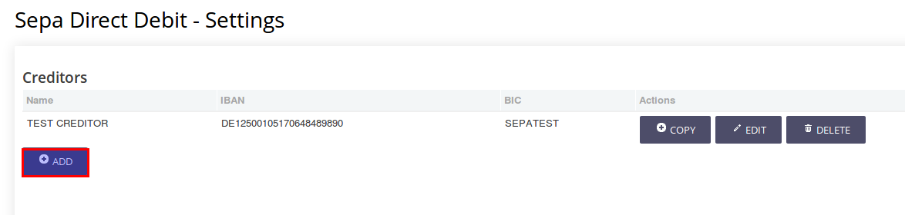
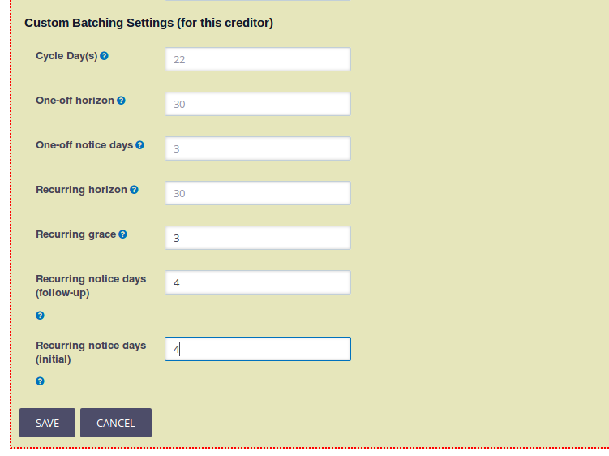
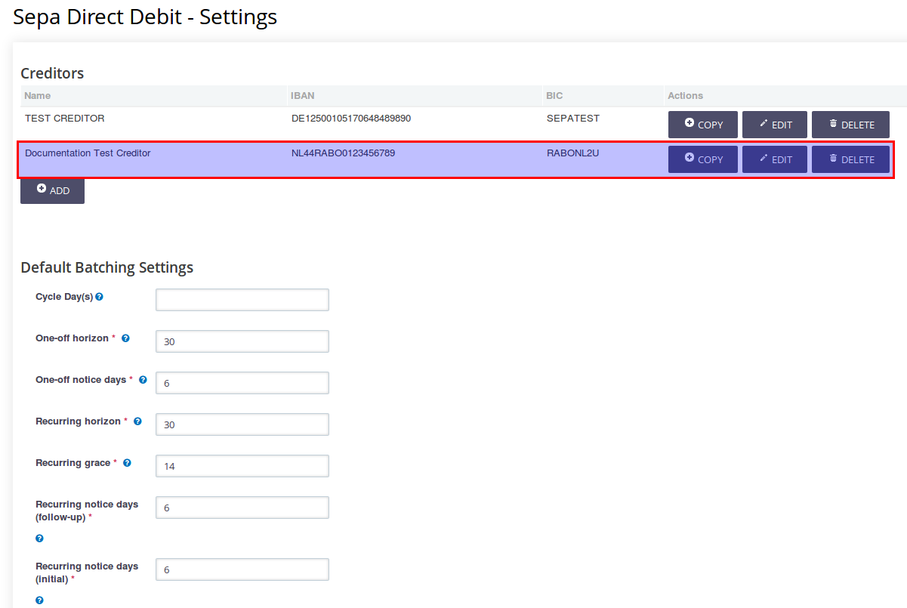

On this page we will give you an example of a basic configuration you can use for CiviSEPA.

The members of the CiviCRM community that have created this documentation have tried this configuration at the time of writing and it works. We will also test this configuration with every new major release of the CiviSEPA extension and update the documentation when this is required.

!!! note
    If you would like to contribute to the documentation of CiviSEPA you can certainly do so! Every  now and then sprints to update the documentation are organised. In most cases this will be announced on the CiviCRM channels. If you want to make sure you are invited for the next one please drop [betty.dolfing@civicoop.org](mailto:betty.dolfing@civicoop.org) or [erik.hommel@civicoop.org](mailto:erik.hommel@civicoop.org) a mail.
    
Of course the configuration that is described on this page is not the only possibility, CiviSEPA can do a lot more. 
You can have more days on which to collect the money, longer or shorter horizons to create pending contributions for etc. 

There are a lot of possibilities, but we would recommend you contact a CiviCRM expert to assist you with the configuration if that is what you want.
And it helps if you also have a clear picture of what you want exactly and why this is important for you.

This configuration is aimed at those organisations that would be happy to just get a configuration that works.

## Recurring and One-Off SEPA collections
There are two ways in which you can collect money from donors or members with SEPA:

* the One Off collection where you get permission to collect money from an account once and once only
* the Recurring collection where you get permission to collect money from an account on a regular basis (for example monthly) until it is cancelled by the donor or member. 

!!! Note
    Although there are only One-off and Recurring collections, SEPA demands that for recurring collections 2 different _types_ are used when sending the collections to the bank. 
    
    When a recurring collection is sent for the **first** time the type will be FRST.
    
    Once the collection has been done succesfully for the first time all the **following** collections will be stamped as type RCUR. 
    
    CiviSEPA will handle this for you, you just specificy that a new SEPA contribution is a recurring or one-off. When sending collections to the bank, the FRST collections and the RCUR collections will each have their own file.
    
    By the way, CiviSEPA uses the OOFF type for One-off collections.
    
## The example SEPA configuration
You can find the CiviSEPA settings with **Administer>CiviContribute>CiviSEPA Settings**.

!!! tip "CiviCRM installation"
    The example configuration as shown in this documentation is done on a Drupal 7 sandbox with CiviCRM 5.1.2 using the _Shoreditch_ extension as a theme.

**Creditors**

If you access this CiviSEPA settings form for the first time the top will probably look like this: 
And a lot more stuff below this, but as a first step you need to create a creditor. CiviSEPA will be installed with a Test Creditor but you need to set up your own.
You can do this by clicking on the **ADD** button just below **Creditors**.

!!! note
    You can have more creditors if you use more bank accounts. The basic configuration example assumes you only need one creditor.

In the form you will first enter general information about you and your organization in the top half of the screen, as you can see in the example: .
 
* **Name** - here you enter the name of your creditor
* **Is this a test creditor** - leave this at the default value (because this is not a test creditor)
* **Creditor Contact** - the contact in CiviCRM associated with the creditor (in most cases your organization)
* **Address** - the address where the creditor is based (in most cases the address of your organization)
* **Country** - the country of the creditor's address
* **Currency** - the currency the collections will be in (most likely EUR)
* **Identifier** - this is an international ID that you should get from your bank 
* **IBAN** - the IBAN (account number)
* **BIC** - the BIC number that goes with the IBAN (account number)
* **PAIN version** PAIN is the format that your bank uses. You need to provide your file in this format for your bank to be able to read it. Your bank should be able to tell you what the version is, and it should be in the list you can select from.
* **Transaction Message** - the message that is sent to the member or donor when collecting

!!! warning
    If the PAIN version your bank has given to you is not present in the list where you can select from (which would be really weird and you should consider changing bank!) we recommend you contact a CiviCRM/CiviSEPA expert.
    
In the bottom part of the form you will enter specific configuration settings for your creditor as you can see here: 

* **Cycle Day(s)** - (22) this contains the actual date you want to collect the money from the donors or members. In the basic configuration we suggest you only use one cycle day. In the example we have entered 22 as in The Netherland most people get their wages into their account on the 20th of each month. You need to specify the actual calendar day.
* **One-off horizon** - (30) this is the _look ahead_ time frame (in days) that CiviSEPA uses to determine which single collections (**contributions** in CiviCRM) (One-off) should be generated. A horizon value of 30 means that the collections for the next 30 days will be generated.
* **One-off notice days** - (3) the number of days your bank needs before they can actually collect the money for one-off collections. If your bank needs 3 days, it means that if you want to collect money on the 23rd you will have to send the file with the collections on the 20th at the latest.
* **Recurring horizon** - (30) this is the _look ahead_ time frime (in days) that CiviSEPA uses to determine which recurring collections (**contributions** in CiviCRM) should be generated. A horizon value of 30 means that the collections for the next 30 days will be generated.
* **Recurring grace** - (4) this is the number of days the file with the collections will still be available if you forget to send them to the bank (which you should **not** do!). So if you should have sent the file to the bank on the 18th and the recurring grace is 3, the file will still be present for you to send to the bank until the 21st. On the 22nd the file will be gone.
* **Recurring notice days (follow-up)** - (4) the number of days your bank needs before they can actually collect the money for recurring collections. In this case this only counts for the collections of the type **RCUR**, which means this is NOT the first collection on the mandate (see [Recurring and One-Off SEPA collections
](#recurring-and-one-off-sepa-collections)).
* **Recurring notice days (initial)** - (3) the number of days your bank needs before they can actually collect the money for the recurring collections that are now collected for the first time (so type is **FRST**, see [Recurring and One-Off SEPA collections](#recurring-and-one-off-sepa-collections)).

!!! note "Note on Cycle Day(s)"
    Obviously you can also use more collection or cycle days. This might also have an impact for some of the other setttings.
    In our experience most of the somewhat smaller organisations are perfectly happy with one collection date. The somewhat bigger organisations that do want more collection days are usually comfortably enough changing the other settings too.
    
!!! note "Note on Recurring Grace"
    If you forget to send the file with collections to the bank and send it 2 days later, be aware that the collection days will also be moved 2 days further. 
    So if I should have sent on 18 April for a collection date of 22 April, and I actually send the file on the 20 April the collection date will be set to 24 April. If that would not be done, the bank will possibly reject the file because you have not given them their required notice days. 

Once you have entered all the settings as mentioned above you hit the **Save** button to save the creditor with its settings.                                                                                                                                                                                                                                                               
Your form will now look like this: . The creditor you have just created will be in the list.                                                                                                                                                                                                                                                          
                                                                                                                                                                                                                                                                                                                                                                                            
!!! attention
    The **Default Batching Settings** you see below the list of creditors is just the default settings when you create a new creditor, they do NOT reflect the settings CiviSEPA will use. This seems a bit confusing, but CiviSEPA will use the settings in your creditor like you have just saved it. If you want to check or change them, you hit the **Edit** button next to your creditor.
    
    If you want to you can also first update the **Default Batching Settings** before you create the creditor, and then create a new creditor. This new creditor will then have those default batching settings. 