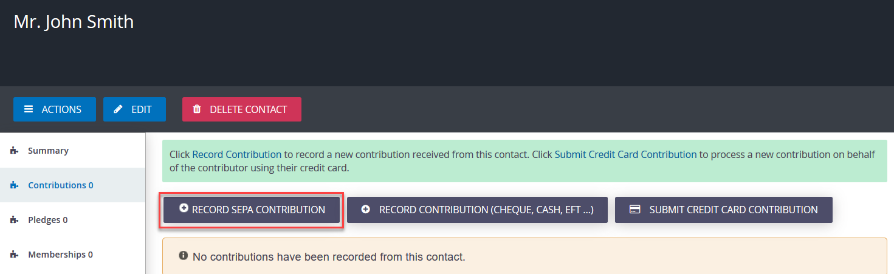
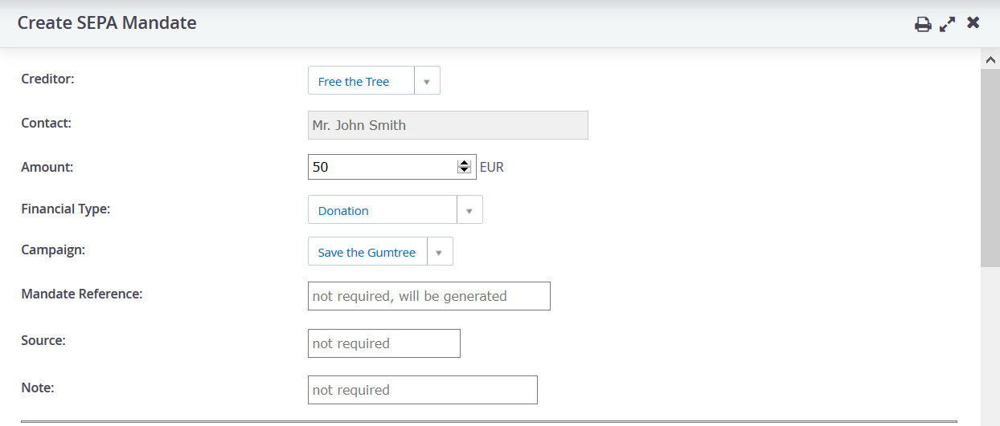
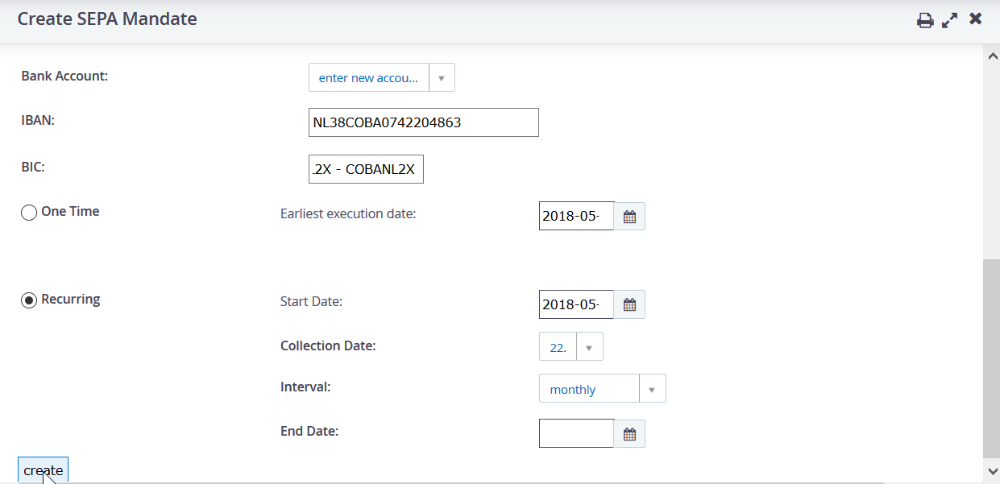
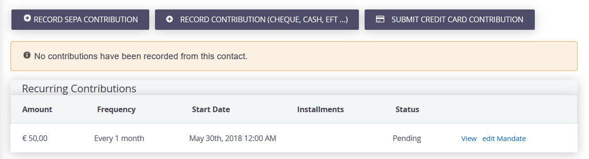
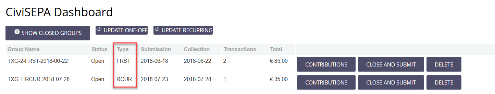
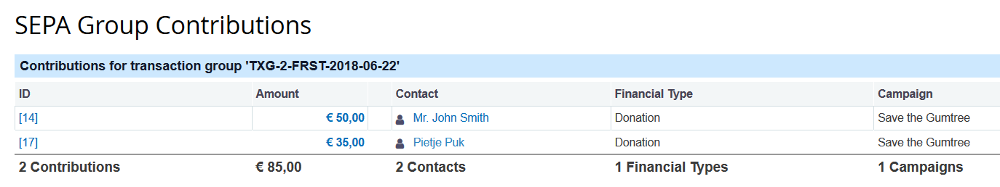
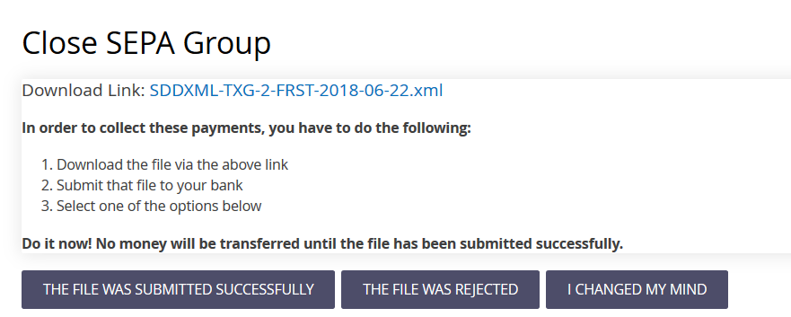
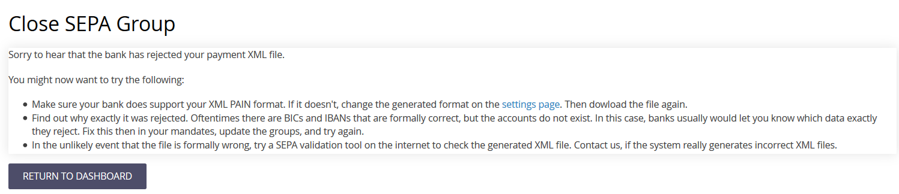

On this page we will explain the working of SEPA from a user perpective for both a Recurring and a One Off Contribution.

## Recurring Contribution
Your organisation 'Free the Tree' wants to process donations that sympathisers want to donate on a regular basis. 
E.g. John Smith wants to donate 50 Euro on a monthly basis to your organisation.

He wants to do that automatically by direct debit. 

He sends or gives his information to your organisation, giving you the permission to automatically collect money on a monthly basis. 

You want to register that in CiviCRM, send a file to the bank that will then collect the money from his bank account. 
And you want to do that for all recurring contributions for a certain period. 

This is what you want to do, right?

I will show you how that is done step by step: 

## Step 1: Add the recurring contribution/mandate
First navigate to the contact for John Smith or create John Smith as an individual. Next click on the **Contributions** tab for John Smith. From this page you can click on **Record SEPA Contribution** to add a mandate.

!!! note
    In CiviSEPA version later than 1.2.5 SEPA Mandates have their own tab on the **Contact Summary**. 
    
    From this version on you navigate to the contact, click on the **SEPA Mandates** tab and then click on **Add SEPA Mandate**.

Now set up the mandate by adding a recurring contribution to CiviCRM entering the following information:

* **Amount**: 50,00
* **Financial Type**: Donation
* **Campaign**: Save the gumtree
* **Mandate reference**: automatically generated by CiviSEPA if you do not enter anything here.
* **Source**: the source of the mandate, e.g. a street action, through the website eg. You can leave it empty if you want to. 
* **Notes**: 'thank you' In your SEPA configuration you can edit the message. This is for all SEPA's the same

!!! Note "Customisation Mandate Reference"
	If you want to change the format of the mandate reference e.g. the date or the name of a campaign, you will have to add code to the extension. A developer can do that for you.  
!!! Note "Customisation Note"
	If you want to have a separate note for donations, memberships or campaigns, you need to do that through customisation. Ask help to do that. 
	
The second part of the mandate contains information about the bank account of the donor and the type of SEPA contribution

* **Account Holder** - This is the account holder of the bank account. Leave empty if it is the same as the contact.
* **IBAN**: the bank account number. There is a check to verify if it is a valid bank account number
* **Bic**: BIC code of the bank
* **Set start date**: always a date in the future, so register in time to be up to date with your mandates 
* **Set interval**: monthly
* **End date**: is not applicable

!!! Note "Interval"
	You can choose different intervals. If it is e.g. bimonthly, then SEPA 'knows' that it will only generate a contribution once every 2 months. 
	
!!! Note "End date"
	To end a mandate, you can simply add the end date. 
	
A Mandate has now been created for John Smith's donation. This is the 'Agreement' between John Smith and Free the Tree.
You will see the mandate in the page with the main details. You can either **View** or **Edit** the mandate with the links behind the mandate.
 

Now it is time to create contributions and collect the money. 

## Step 2: Generate contributions for the monthly installment
In CiviCRM with the SEPA extension an extra menu item has been installed: **Contributions>CiviSepa Dashboard**, that shows information of contributions that need to be collected. 

It's the 1st of the month and Free the Tree wants to know how many people will donate the upcoming month and what amount they can expect.
Go to the dashboard and click **Update recurring contribution**. 
Based on the settings (check [Configuration Example](config-example)) it will generate contributions for all recurring mandates that are 30 days ahead (horizon). 
For Mr. John Smith a pending contribution has been created for the 22nd of that month. 

On the dashboard lines are shown with info about the specific group of all contributions: 

* **Name of the group**: Generated automatically by CiviCRM/Sepa. Contains info if it is First of Recurring. Contains the collection date. 
* **Status of the group**: open (or closed) 
* **Type**: First or recurring. The contribution of John Smith is in the group of the First.
* **Submission date**: since collection date is 22 and notification to the bank is 4 days, it needs to be submitted to the bank on the 18th. 
* **Collection date**: the bank will collect the money on the 22nd. 
* **Transactions**: number of recurring contributions
* **Total**: amount of all transaction in the group 

!!! Note "First and Recurring"
	SEPA distiguishes between the first time a recurring contribution will be collected, and the later ones. In the dashboard you will therefore see a group with all First time Recurring contributions and a group with all the later ones. 

!!! Note "Update your dashboard"
	You can do the updating of the dashboard as many times as you want, depending on your needs.  

## Step 3: Sending the file to the bank
You are collecting the money on the 22nd and have a notification to the bank of 4 days. 
So on the 18th at the latest you need to generate your file and submit it to the bank. 

Before you send your file to the bank, you might want to see if the file contains the correct information. 
Click **Contributions** and you will see an overview of all contacts and amounts. 

**Generate file**

Click **Close and Submit** in the dashboard and you are able to download the XML file. (This is the format of the file you send to the bank) 

You now have three options: 

* **I changed my mind**: you choose that option if you want to check what the file looks like but don't want to send it to the bank as yet. 
* **The file was rejected by the bank**: you will see the following information.

If all is well this will never happen, but if so you will have to check your settings and check with the bank. 
* **The file was submitted succesfully**: the group will be closed. In practice you usually close the group when the bank has accepted the file and the file is processed. 

!!! Note "Status Contribution"
	After having closed the group, the status of the contribution changes from 'Pending (incomplete transaction) into 'in Progress'. 
	The user should not edit this contribution since it is on the way to the bank. 
	If you DO edit this, you will have the chance that you no longer can reconciliate or that bank imports can not be matched. 

 